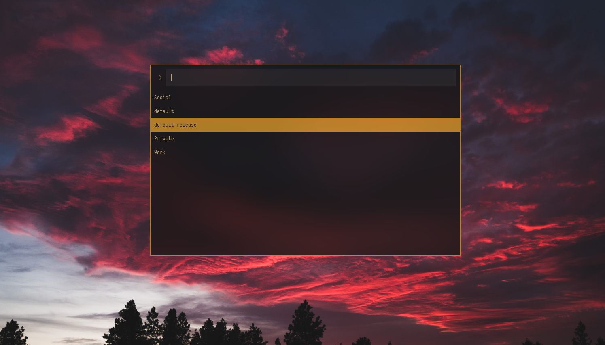

# Rofirefox

Rofirefox is a simple script for displaying and launching your Firefox profiles using rofi

# Installation

```bash
git clone https://github.com/ethmtrgt/rofirefox
cd rofirefox
sudo make install
```

<br>

Simply uninstall rofirefox by running `sudo make uninstall`.

# Usage

Launch the menu by running `rofirefox` command.

# Preview



